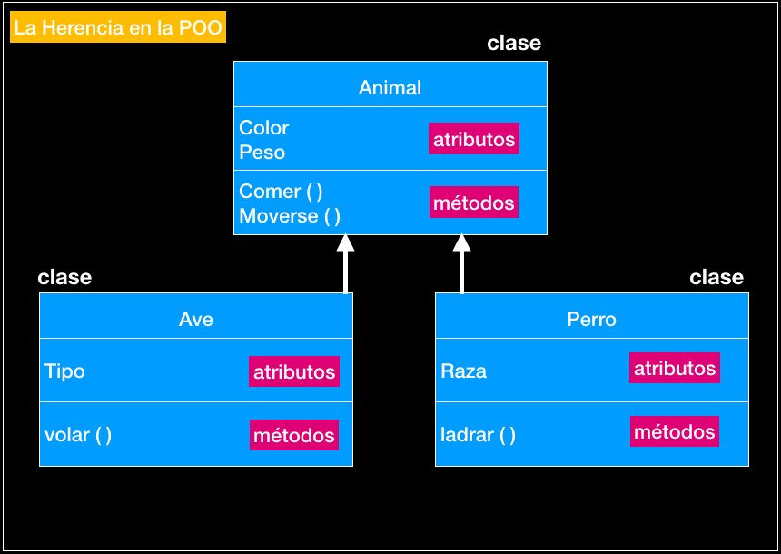

# Paradigma OO

## Paradigma

Un paradigma de programación es una manera o estilo de programación de software. Existen diferentes formas de diseñar un lenguaje de programación y varios modos de trabajar para obtener los resultados que necesitan los programadores.  Se trata de un conjunto de métodos sistemáticos aplicables en todos los niveles del diseño de programas para resolver problemas computacionales.

## Programacion Orientada a Objetos (El primer lenguaje creado y sus creadores)

La Programación Orientada a Objetos (POO) es un paradigma de programación, es decir, un modelo o un estilo de programación que nos da unas guías sobre cómo trabajar con él. Se basa en el concepto de clases y objetos. Este tipo de programación se utiliza para estructurar un programa de software en piezas simples y reutilizables de planos de código (clases) para crear instancias individuales de objetos. 
Fue en Noruega en 1967 con el lenguaje llamado Simula 67, desarrollado por Krinsten Nygaard y Ole-Johan Dahl, en el centro de cálculo noruego.

## Abstraccion

Es una manera en la cual de un objeto se le puede extrare las caracteristicas que lo hacen el, aquellas que son genericas, que se pueden replicar y que pueden enlistarse, esto hace que el codigo no se repita mucho y que no gaste tanto espacio de la consola

## Encapsulamiento

La encapsulación contiene toda la información importante de un objeto dentro del mismo y solo expone la información seleccionada al mundo exterior. 
Esta propiedad permite asegurar que la información de un objeto esté oculta para el mundo exterior, agrupando en una Clase las características o atributos que cuentan con un acceso privado, y los comportamientos o métodos que presentan un acceso público.

Este codigo no esta encapsulado

Este codigo esta encapsulado

## Herencia

La herencia se trata de dos objetos, el padre y el hijo, estos tienen el mismo comportamiento o las mismas propiedades pero el hijo tiene mas propiedades o menos de las que tiene el padre, pero que siguen teniendo el requisito para estar relacionados

***

# Diagrama de Clases

## Resumen de UML

## Propuesta de una maquina

#### UML

[UML]

***

# Referencias

*[Paradigma](https://profile.es/blog/que-son-los-paradigmas-de-programacion/)

*[Encapsulamiento](https://profile.es/blog/que-es-la-programacion-orientada-a-objetos/)

*[Historia de POO](http://sis324loo.blogspot.com/2008/09/historia-de-los-lenguajes-de_29.html)

*

*
